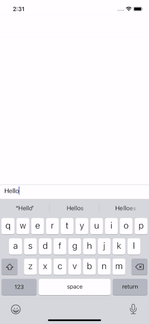

react-native-controlled-mentions [![npm version][npm-image]][npm-url]
-
Pretty simple and fully controlled mention input. It can:

* Gracefully render formatted mentions directly in RN `TextInput` component
* Support for different mention types (**[@user mentions](#demo)**, **#hashtags**, etc)
* Use `value`/`onChange` as in usual `TextInput` props
* Completely typed (written on TypeScript)
* No need for native libraries

In addition, you can add custom styling for a regex pattern (like URLs) using the optimized recursive function for parsing the value.

Demo
-
Try it on Expo Snack: https://snack.expo.io/@dabakovich/mentionsapp



Getting started
-

Install the library using either Yarn:

``yarn add react-native-controlled-mentions``

or npm:

``npm install --save react-native-controlled-mentions``

Usage
-

Import the [MentionInput](#mentioninput-component-props) component:

```tsx
import { MentionInput } from 'react-native-controlled-mentions'
```

Replace your [TextInput](https://reactnative.dev/docs/textinput) by [MentionInput](#mentioninput-component-props) component and add the `partTypes` property where you can define what mention or pattern types you want to support. It takes an array of [PartType](#parttype-type) objects.

```tsx
<Mentions
  value={value}
  onChange={setValue}

  partTypes={[
    {
      trigger: '@', // Should be a single character like '@' or '#'
      renderSuggestions,
      textStyle: {fontWeight: 'bold', color: 'blue'}, // The mention style in the input
    },
  ]}
/>
```

Define your `renderSuggestions` functional component that receive [MentionSuggestionsProps](#mentionsuggestionsprops-type-props):

```tsx
const suggestions = [
  {id: '1', name: 'David Tabaka'},
  {id: '2', name: 'Mary'},
  {id: '3', name: 'Tony'},
  {id: '4', name: 'Mike'},
  {id: '5', name: 'Grey'},
];

const renderSuggestions: FC<MentionSuggestionsProps> = ({keyword, onSuggestionPress}) => {
  if (keyword == null) {
    return null;
  }

  return (
    <View>
      {suggestions
        .filter(one => one.name.toLocaleLowerCase().includes(keyword.toLocaleLowerCase()))
        .map(one => (
          <Pressable
            key={one.id}
            onPress={() => onSuggestionPress(one)}

            style={{padding: 12}}
          >
            <Text>{one.name}</Text>
          </Pressable>
        ))
      }
    </View>
  );
};
```

You're done!

The whole example is in the `/example` folder.

API
-

### `MentionInput` component props

| **Property name**     | **Description**                                                	    | **Type**                                  | **Required** 	| **Default** 	|
|-------------------	|--------------------------------------------------------------------   |----------------------------------------   |------------   |------------   |
| `value`             	| The same as in `TextInput`                                            | string                 	                | true     	    |               |
| `onChange`          	| The same as in `TextInput`                                            | (value: string) => void 	                | true     	    |               |
| `partTypes`      	    | Declare what part types you want to support (mentions, hashtags, urls)| [PartType](#parttype-type)[]              | false    	    | []            |
| `inputRef`          	| Reference to the `TextInput` component inside `MentionInput`	        | Ref\<TextInput>          	                | false    	    |               |
| `containerStyle`    	| Style to the `MentionInput`'s root component                 	        | StyleProp\<TextStyle>                     | false    	    |               |
| ...textInputProps 	| Other text input props                                     	        | TextInputProps         	                | false    	    |               |

### `PartType` type
[MentionPartType](#mentionparttype-type-props) | [PatternPartType](#patternparttype-type-props)

### `MentionPartType` type props

| **Property name**             | **Description**                                                                       | **Type**                                                                              | **Required** 	| **Default** 	|
|---------------------------	|-----------------------------------------------------------------------------------	|-----------------------------------------------------------------------------------	|------------   |-----------    |
| `trigger`                   	| Character that will trigger current mention type                                     	| string                                        	                                    | true     	    |               |
| `renderSuggestions`         	| Renderer for mention suggestions component                                           	| (props: [MentionSuggestionsProps](#mentionsuggestionsprops-type-props)) => ReactNode 	| false    	    |               |
| `isInsertSpaceAfterMention` 	| Should we add a space after selected mentions if the mention is at the end of row 	| boolean                                       	                                    | false    	    | false         |
| `textStyle`                 	| Text style for mentions in `TextInput`                                                | StyleProp\<TextStyle>                         	                                    | false    	    |               |
| `getPlainString`            	| Function for generating custom mention text in text input                         	| (mention: [MentionData](#mentiondata-type-props)) => string              	            | false    	    |               |

### `PatternPartType` type props

| **Property name**             | **Description**                                                                       | **Type**                                                                              | **Required** 	| **Default** 	|
|---------------------------	|-----------------------------------------------------------------------------------	|-----------------------------------------------------------------------------------	|------------   |-----------    |
| `pattern`                   	| RegExp for parsing a pattern, should include global flag                              | RegExp                                        	                                    | true     	    |               |
| `textStyle`                 	| Text style for pattern in `TextInput`                                                 | StyleProp\<TextStyle>                         	                                    | false    	    |               |

### `MentionSuggestionsProps` type props

`keyword: string | undefined`

Keyword that will provide string between trigger character (e.g. '@') and cursor.

If the cursor is not tracking any mention typing the `keyword` will be `undefined`.

Examples where @name is just plain text yet, not mention and `|` is cursor position:

```
'|abc @name dfg' - keyword is undefined
'abc @| dfg' - keyword is ''
'abc @name| dfg' - keyword is 'name'
'abc @na|me dfg' - keyword is 'na'
'abc @|name dfg' - keyword is against ''
'abc @name |dfg' - keyword is against undefined
```
`onSuggestionPress: (suggestion: Suggestion) => void`

You should call that callback when user selects any suggestion.

### `Suggestion` type props

`id: string`

Unique id for each suggestion.

`name: string`

Name that will be shown in `MentionInput` when user will select the suggestion.

### `MentionData` type props

For example, we have that mention value `@[David Tabaka](123)`. Then after parsing that string by `mentionRegEx` we will get next properties:

`original: string`

The whole mention value string - `@[David Tabaka](123)`

`trigger: string`

The extracted trigger - `@`

`name: string`

The extracted name - `David Tabaka`

`id: string`

The extracted id - `123`

### `mentionRegEx`

```jsregexp
/(?<original>(?<trigger>.)\[(?<name>([^[]*))]\((?<id>([\d\w-]*))\))/gi;
```


Parsing `Mention`'s value
-

You can import RegEx that is using in the component and then extract all your mentions
from `Mention`'s value using your own logic.

```ts
import { mentionRegEx } from 'react-native-controlled-mentions';
```

Or you can use `replaceMentionValues` helper to replace all mentions from `MentionInput`'s input using
your replacer function that receives [MentionData](#mentiondata-type-props) type and returns string.

```ts
import { replaceMentionValues } from 'react-native-controlled-mentions';

const value = 'Hello @[David Tabaka](5)! How are you?';

console.log(replaceMentionValues(value, ({id}) => `@${id}`)); // Hello @5! How are you?
console.log(replaceMentionValues(value, ({name}) => `@${name}`)); // Hello @David Tabaka! How are you?
```

To Do
-

* ~~Add support for different text formatting (e.g. URLs)~~
* ~~Add more customizations~~ DONE
* ~~Add ability to handle few mention types ("#", "@" etc)~~ DONE

Known issues
-

* Mention name regex accepts white spaces (e.g. `{name: ' ', value: 1}`)
* ~~Keyboard auto-correction not working if suggested word has the same length~~ FIXED
* ~~Text becomes transparent when setting custom font size in TextInput~~ FIXED

[npm-image]: https://img.shields.io/npm/v/react-native-controlled-mentions
[npm-url]: https://npmjs.org/package/react-native-controlled-mentions
